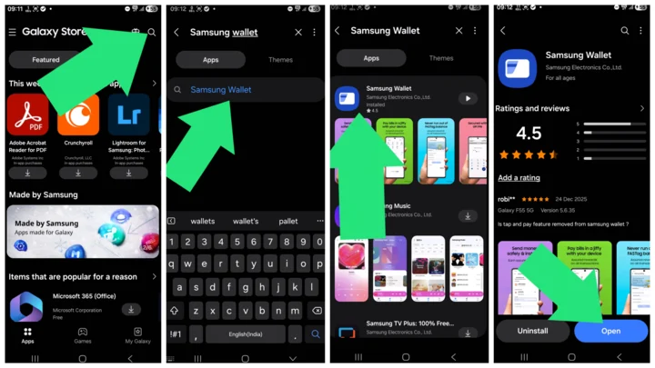
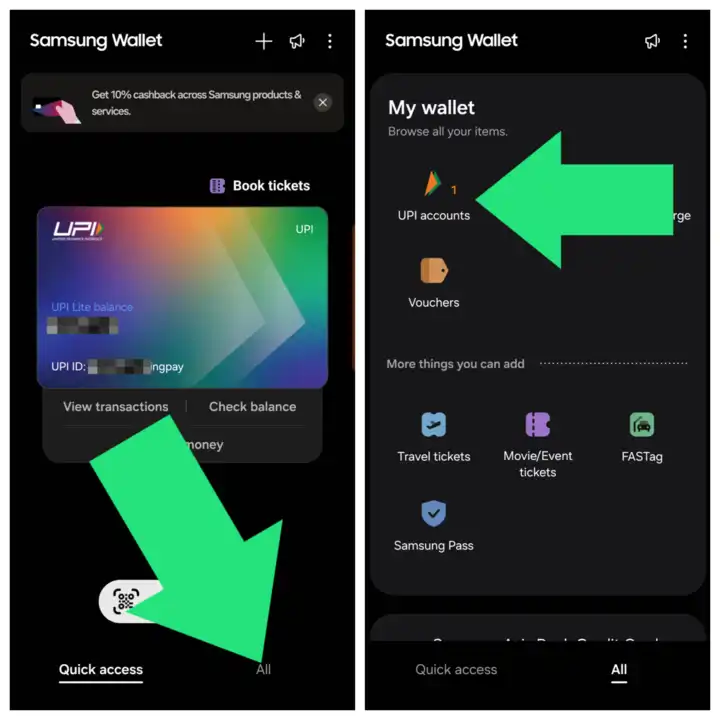
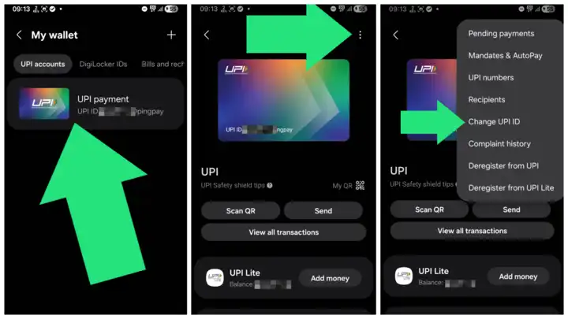
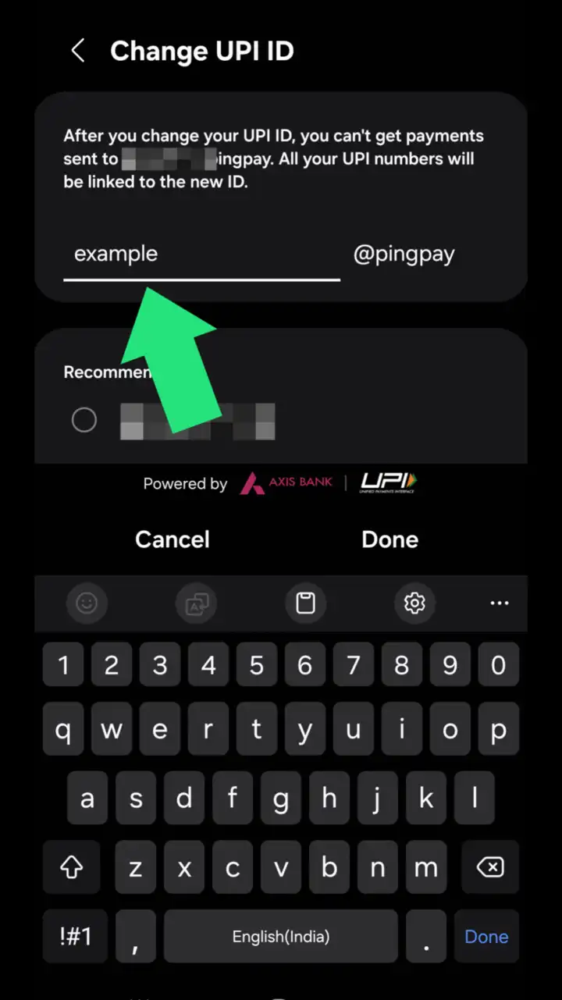

Want to customize your Samsung Wallet UPI ID? By default, Samsung Wallet sets your UPI ID to something generic like **your-email@pingpay** or your mobile number. 

But did you know you can change it to something cool, professional, or just easier to remember? In this guide, I’ll show you exactly how to create a custom UPI ID on your Samsung phone in just a few taps.

## Steps

### 1. Update the App
Before starting, ensure you have the latest version of the app to see the correct menus.

1. Open **Galaxy Store** on your phone.
2. Tap the **search icon** (magnifying glass) or the search bar at the top.
3. Type **Samsung Wallet** and hit search.
4. Open the Samsung Wallet app page.
5. If you see an **Update** button, tap it. If it says **Open**, you are already up to date.

### 2. Open Samsung Wallet
Launch the **Samsung Wallet** app from your app drawer.

### 3. Navigate to UPI Settings
1. Tap the **All** tab (usually located at the bottom right).
2. Tap on **UPI Accounts** (found under the *My wallet* section).

### 4. Change Your ID
1. Tap on your existing **UPI payment** account.
2. Tap the **3-dot menu** in the top right corner.
3. Select **Change UPI IDs** .

### 5. Create Custom ID
1. Type your desired username (e.g., yourname@pingpay).
2. Tap **Done**.

---

### That is it! 
Your new custom UPI ID is now active. You can now share this specific ID with friends or clients instead of sharing your phone number.