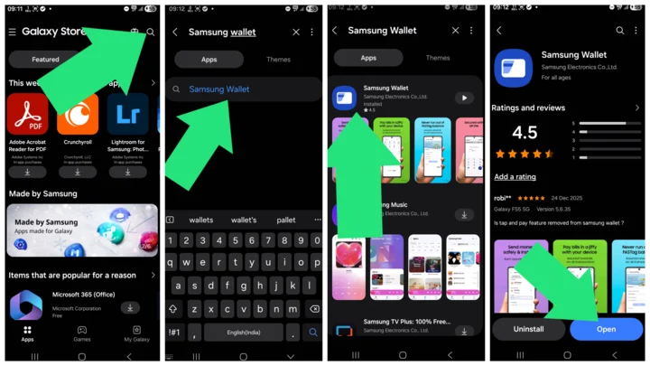
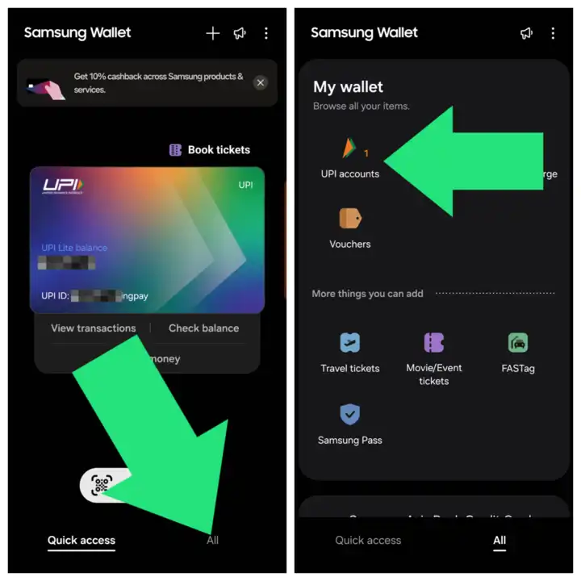
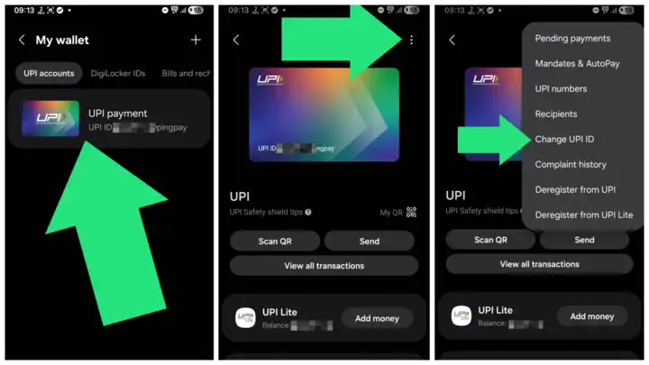
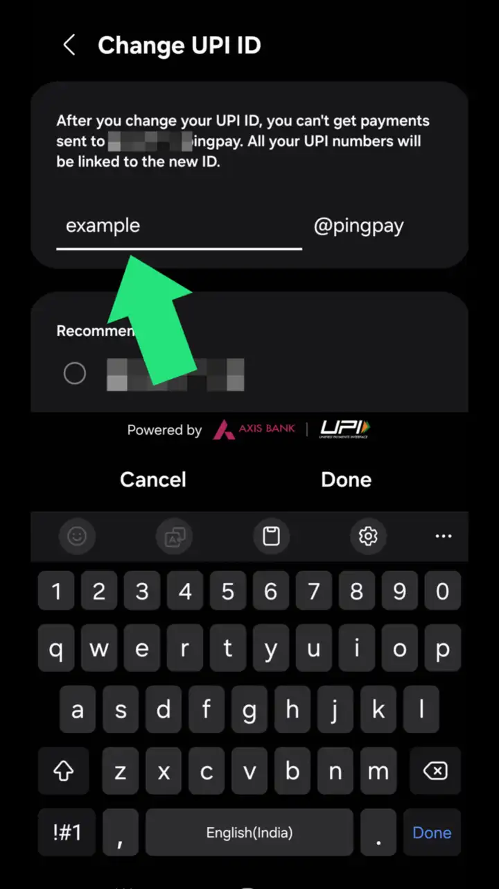

Want to customize your Samsung Wallet UPI ID? By default, Samsung Wallet often sets your UPI ID to something generic like **your-email@pingpay** or your mobile number.

If you are looking for how to change UPI ID in Samsung Wallet, this tutorial shows the exact steps to create a custom UPI ID on your Samsung phone in just a few taps.

## Steps

### 1. Update the App

Before starting, ensure you have the latest version of the app to see the correct menus.

1. Open **Galaxy Store** on your phone.
2. Tap the **search icon** (magnifying glass) or the search bar at the top.
3. Type **Samsung Wallet** and hit search.
4. Open the Samsung Wallet app page.
5. If you see an **Update** button, tap it. If it says **Open**, you are already up to date.

### 2. Open Samsung Wallet

Launch the **Samsung Wallet** app from your app drawer.

### 3. Navigate to UPI Settings

1. Tap the **All** tab (usually located at the bottom right).
2. Tap on **UPI Accounts** (found under the _My wallet_ section).

### 4. Change Your ID

1. Tap on your existing **UPI payment** account.
2. Tap the **3-dot menu** in the top right corner.
3. Select **Change UPI IDs** .

### 5. Create Custom ID

1. Type your desired username (e.g., yourname@pingpay).
2. Tap **Done**.

---

### That is it!

Your new custom UPI ID is now active. You can now share this specific ID with friends or clients instead of sharing your phone number.

## Frequently Asked Questions

### Can I change my UPI ID multiple times?

Yes, you can change your UPI ID multiple times in Samsung Wallet. However, it is better to stick to one professional ID to avoid confusion during transactions.

### Is it safe to use a custom UPI ID?

Absolutely. A custom UPI ID (VPA) is just an alias for your bank account. The underlying security and encryption remains the same as any other UPI transaction.

### What happens to my old UPI ID?

Once you change it, your old ID might become inactive or remain as a secondary ID depending on your bank's policy.

For more official information, you can visit the [Samsung Pay India Support Page](https://www.samsung.com/in/samsung-pay/).

---

If you also want a privacy-focused notes workflow, read: [3 Best Privacy-First Note-Taking Apps](/posts/best-note-taking-apps)
